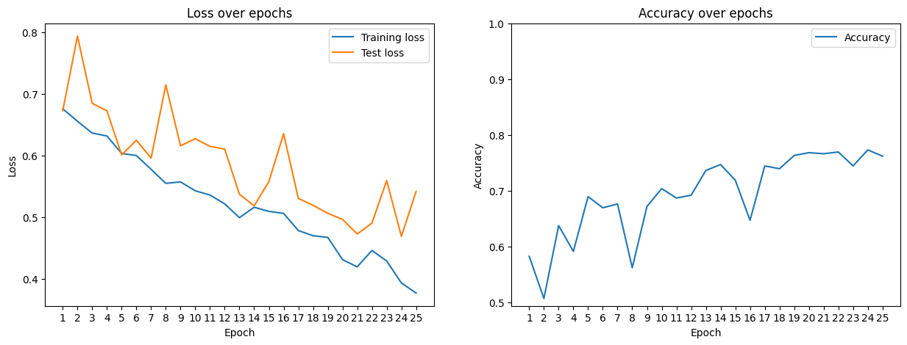
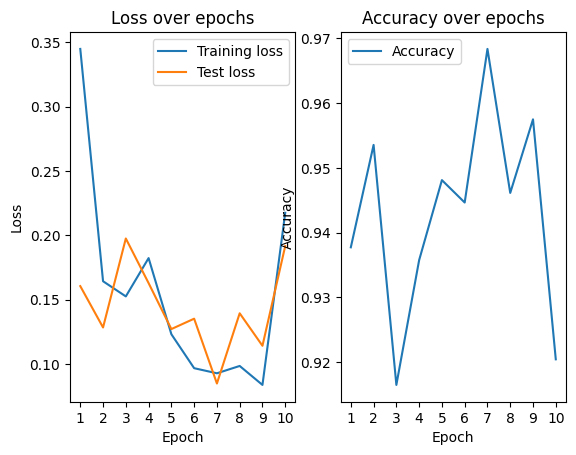

# Cat vs Dog Classifier

---

## Introduction
This project implements a deep learning classifier to distinguish between cat and dog images using **PyTorch**.  
It demonstrates data preprocessing, model training, evaluation, and prediction workflows.  

The [Cat and Dog Dataset on Kaggle](https://www.kaggle.com/datasets/tongpython/cat-and-dog) is organized into two classes (`cats/` and `dogs/`), stored in separate subdirectories.

---

## Project Structure
classification_cat_dog/ <br>
│── assets/  <br>
│── inference/ <br>
│── models/ <br>
│── train/ <br>

---

## Content

The training pipeline for image classification is located under `train/`.  
The backbone of the model is **EfficientNet-B0**, followed by NN layers.  
It can either be trained from scratch or initialized with pretrained EfficientNet-B0 weights.  

**Model results** <br>

Highest accuracy on validation dataset without pretrained weights: **0.7732** <br>
<div align="center">
 
</div>
<br>

Highest accuracy on validation dataset with pretrained weights: **0.9544** <br>
<div align="center">

</div>

<br>

The best models from each training run are saved under `models/` and can later be used for inference.
We notice that the training with pretrained weights is not increasing the accuracy after the first epoch as it is already very high.
Inference scripts are located under `inference/`, where predictions can be run on the test dataset or on custom images.
Furthermore, we compute the accuracy on the test dataset.
For the model trained from scratch the final accuracy is **0.7978** and the pretrained model has an accuracy of **0.9619**.

<p>
A demonstration of inference on custom images is provided in the notebook  
<a href="example_notebook.ipynb">example_notebook.ipynb</a>.
</p>

<br>
<div align="center">
 
</div>

<div align="center">

</div>

---

## Installation 

Creat python env 
```bash 
conda create -n classification_cat_dog python==3.10 
conda activate classification_cat_dog 
``` 
Clone the repository and install dependencies: 
```bash 
git clone https://github.com/WJannik/classification_cat_dog.git 
cd classification_cat_dog 
pip install -r requirements.txt
```
