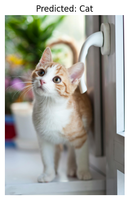
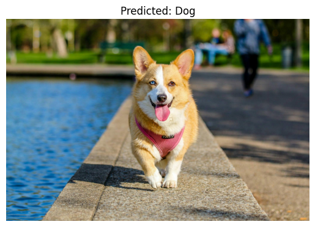

# Cat vs Dog Classifier

---

## Intro
This project implements a deep learning classifier to distinguish between cat and dog images using PyTorch.  
It demonstrates data preprocessing, model training, evaluation, and prediction workflows.  
The [Cat and Dog Dataset on Kaggle](https://www.kaggle.com/datasets/tongpython/cat-and-dog) is organized into two classes (cats and dogs) stored in separate subdirectories.

---

## Structure
classification_cat_dog/ <br>
│── assets/  <br>
│── inference/ <br>
│── models/<br>
│── train/<br>

---

## Content

Under training you find the trainings pipeline for image classification. The backbone of the model is EfficientNet-B0,which is than followed by a CNN. It can either be trained from scratch or with the pretrained weights from EfficientNet-B0. <br>
**Results of training:** <br>

Accuracy without pretrained weights: 0.7829 <br>
<div align="center">
 
</div>
<br>
Accuracy with pretrained weights: 0.9683 <br>
<div align="center">

</div>

<br>
The best models of each training is saved under models and can later be used for inference. <br>
Under inference we set up the prediction either for our test data set or our own images.
<p>
A demonstration of the inference of your own images is in the notebook 
<a href="example_notebook.ipynb">example_notebook.ipynb</a>.
</p>
<br>
<div align="center">
 
</div>

<div align="center">
  
</div>

---

## How to install

Creat python env

```bash
conda create -n classification_cat_dog python==3.10
conda activate classification_cat_dog
```
Clone the repository and install dependencies:

```bash
git clone https://github.com/WJannik/classification_cat_dog.git
cd classification_cat_dog
pip install -r requirements.txt
```
